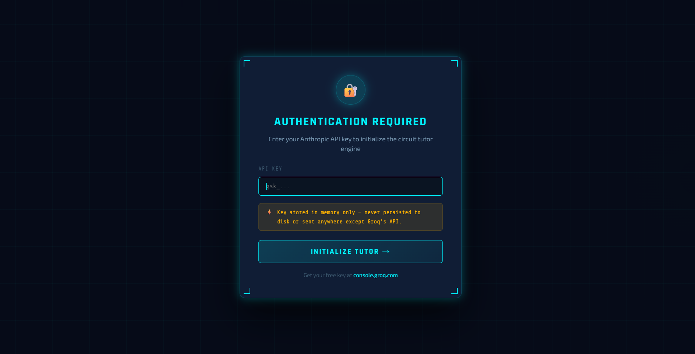
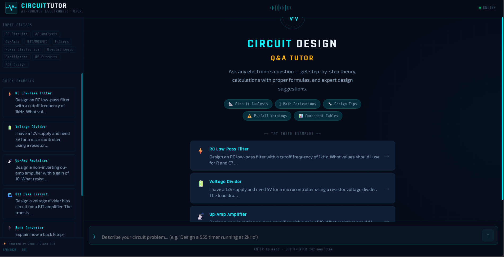

# ⚡ Circuit Design Q&A Tutor

An interactive AI-powered tutoring app for electronics and circuit design, built with React and Groq (Llama 3.3 70B).


---

## 📸 Screenshots

### 🔐 API Key Entry Screen


### 🏠 Homepage / Chat Interface


---

## ✨ Features

- **Theory Explanation** — Clear breakdown of electrical/electronic concepts behind any circuit problem
- **Step-by-Step Calculations** — Properly formatted math with LaTeX rendering (KaTeX)
- **Design Improvement Suggestions** — Expert advice on efficiency, reliability, noise immunity
- **Multi-turn Conversation** — Context-aware follow-up questions across the full chat history
- **Markdown + Math Rendering** — Beautiful LaTeX math, tables, code blocks (SPICE netlists, etc.)
- **6 Quick Examples** — One-click starter questions (RC filter, op-amp, BJT bias, etc.)
- **Streaming Responses** — Real-time token-by-token streaming from Groq API
- **Cyberpunk UI** — Industrial/tech aesthetic with animated waveforms and glowing elements

---

## 🚀 Getting Started

### Prerequisites
- Node.js 18+
- A free **Groq API key** → [console.groq.com/keys](https://console.groq.com/keys)

### Installation

```bash
# 1. Clone the repo
git clone https://github.com/YOUR_USERNAME/circuit-design-tutor.git
cd circuit-design-tutor

# 2. Install dependencies
npm install

# 3. Start the dev server
npm run dev
```

Open [http://localhost:3001](http://localhost:3001) in your browser.

You'll see the API key entry screen — paste your Groq key (starts with `gsk_...`) and click **Initialize Tutor**.

### Build for Production

```bash
npm run build
npm run preview
```

---

## 🧩 Project Structure

```
circuit-tutor/
├── public/
│   └── favicon.svg
├── screenshots/               ← Add your screenshots here
│   ├── api_key_page.png
│   └── homepage.png
├── src/
│   ├── components/
│   │   ├── Header.jsx         # App header with logo & stats
│   │   ├── Sidebar.jsx        # Topic filters & quick examples
│   │   ├── MessageBubble.jsx  # Chat messages with Markdown + Math
│   │   ├── ChatInput.jsx      # Auto-resizing textarea + send button
│   │   ├── ApiKeyModal.jsx    # API key entry screen
│   │   └── WelcomeScreen.jsx  # Empty state with featured examples
│   ├── utils/
│   │   └── api.js             # Groq API client + system prompt
│   ├── App.jsx                # Root app with state management
│   ├── main.jsx               # React entry point
│   └── index.css              # Global styles & CSS variables
├── index.html
├── vite.config.js
└── package.json
```

---

## 🔧 Technology Stack

| Tech | Purpose |
|------|---------|
| React 18 | UI framework |
| Vite 5 | Build tool & dev server |
| Groq API | Ultra-fast LLM inference |
| Llama 3.3 70B | The underlying language model |
| react-markdown | Markdown rendering in chat |
| remark-math + rehype-katex | LaTeX math equation rendering |
| KaTeX | Math typesetting engine |

> **Why Groq?** Groq supports browser-side CORS (unlike xAI/Grok or OpenAI), has a generous free tier, and delivers blazing-fast responses via their LPU hardware.

---

## 🎓 Example Questions

| Topic | Question |
|-------|---------|
| RC Filter | Design an RC low-pass filter with cutoff frequency of 1kHz |
| Voltage Divider | Calculate resistors for 12V → 5V with a 10mA load |
| Op-Amp | Design a non-inverting amplifier with gain = 10 |
| BJT Bias | Voltage divider bias circuit with β=100, VCC=15V, IC=5mA |
| Buck Converter | Convert 12V to 5V at 2A — calculate L and C values |
| 555 Timer | Astable oscillator at 1kHz with 50% duty cycle |

---

## 🔐 Security

Your API key is stored **only in memory** during the browser session. It is never:
- Written to `localStorage` or cookies
- Sent to any server other than `api.groq.com`
- Logged or persisted anywhere

Refreshing the page clears the key — you'll need to re-enter it.

---

## 📁 Adding Screenshots to GitHub

Place your screenshots in a `screenshots/` folder at the project root:

```bash
mkdir screenshots
# Copy your files:
# screenshots/api_key_page.png
# screenshots/homepage.png

git add screenshots/
git commit -m "docs: add screenshots"
git push
```

---

## 📄 License

MIT License — free to use, modify, and distribute.
